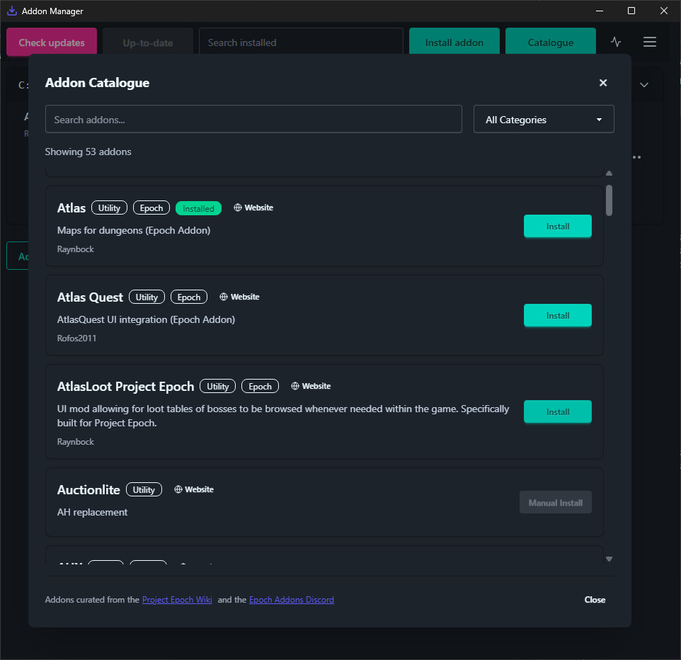

# Git-Based Addon Manager

A modern GUI addon manager that uses Git repositories to install, update, and manage your WoW addons across multiple directories.


**Key Features:**

- Install addons directly from GitHub/GitLab URLs
- Curated catalogue of addons for easy install
- Bulk install/update all addons
- Manage multiple addon directories
- Import/export addon lists
- Cross-platform (Windows, Linux, macOS)

## Table of Contents

- [Git-Based Addon Manager](#-git-based-addon-manager)
    - [Features](#addon-manager-features)
    - [How to Use](#addon-manager-usage)
- [Tech Stack](#tech-stack)
- [Local Development](#local-development)
- [Acknowledgements](#Acknowledgements)

---

## Addon Manager Features

| Feature                                                                        | Supported         |
| ------------------------------------------------------------------------------ | ----------------- |
| Windows, Linux, MacOS                                                          | Yes               |
| Install, Remove, Update addons                                                 | Yes               |
| git sources GitHub, GitLab, etc                                                | Yes               |
| Curated catalogue of addons for easy install                                   | Yes               |
| Install all                                                                    | Yes               |
| Update all                                                                     | Yes               |
| Multiple addon directories                                                     | Yes               |
| Import / Export addon list                                                     | Yes               |
| Switch Git branches                                                            | Yes               |
| Manage subaddons                                                               | Yes               |
| Install via Git (HTTPS)                                                        | Yes               |
| Install via Git (SSH)                                                          | Not planned       |
| Install from GitHub Releases or Packages                                       | Not yet supported |
| Manage non-Git addons                                                          | Not yet supported |
| Auto updater with [Tauri Updater plugin](https://v2.tauri.app/plugin/updater/) | Yes               |
| CLI Headless mode                                                              | Yes               |

## Addon Manager Usage

Usage:

1. Download the latest release for your platform
1. Install and launch the application
1. Select your WoW `Interface/AddOns` folder
1. Add addons using their Git repository URLs

Example Git URLs:

- `https://github.com/Sattva-108/AdiBags.git`
- `https://gitlab.com/username/addon-name.git`




> Note:
> The catalogue is a helpful tool that automatically fills in HTTPS URLs for addons. Addons are curated from the [Project Epoch Wiki](https://project-epoch-wow.fandom.com/wiki/AddOns) and the [Epoch Addons Discord](https://discord.gg/Px4T8VVZwr). This list may contain moved, outdated, or broken repository links.


https://github.com/user-attachments/assets/2491b729-0b62-41d4-bf91-dabb3065cbea

### Command Line Options

```bash
# Run in headless mode to automatically check for updates and update all addons
./addon-manager --headless
# Only shows errors
./addon-manager --headless --quiet
# Show help
./addon-manager --help
```

### Import Format Example

```
C:\Games\wow335\Interface\AddOns AdiBags *https://github.com/Sattva-108/AdiBags.git main
```

## Tech Stack

[](https://www.rust-lang.org)
[](https://vuejs.org)
[](https://tauri.app)
[](https://daisyui.com)

### Core Technologies

- **GUI:** Tauri + Vue.js application with DaisyUI components

## Local Development

### Prerequisites

- Install Rust from the https://www.rust-lang.org/
- Install Bun package manager from https://bun.sh/docs/installation

### Formatting & Pre-commit

To set up formatting and the pre-commit hook:

1. Install Prettier and the Vue Prettier config:

    ```sh
    bun add -D prettier @vue/eslint-config-prettier
    ```

2. Set up the pre-commit hook by creating `.git/hooks/pre-commit` with:

    ```bash
    #!/bin/sh

    cargo fmt --all
    bun run prettier --write .
    ```

    Make sure the hook is executable:

    ```sh
    chmod +x .git/hooks/pre-commit
    ```

3. Run manually
    ```sh
    bunx eslint --ext .ts,.vue addon-manager/src/
    ```

### Catalogue - Adding New Addons

To add a new addon to the catalogue, edit the file:

```
src/data/addonCatalogue.ts
```

Add a new entry to the `ADDON_CATALOGUE` array:

```typescript
{
    name: 'Your Addon Name',
    gitUrl: 'https://github.com/user/repo.git',
    description: 'Brief description of what the addon does',
    author: 'GitHubUsername',
    category: 'ui-enhancement',
    defaultBranch: 'main',
    notes: 'Any warnings or special instructions' // Optional
}
```

## Acknowledgements

The Addon Manager UI and features were inspired by [GitAddonsManager](https://gitlab.com/woblight/GitAddonsManager) and other existing Wow Addon Managers. For an overview of existing addon managers, I recommend this comparison video by Arcane Intellect: [WoW Addon Managers Compared](https://www.youtube.com/watch?v=_V0RZG4YRVY)

## License
