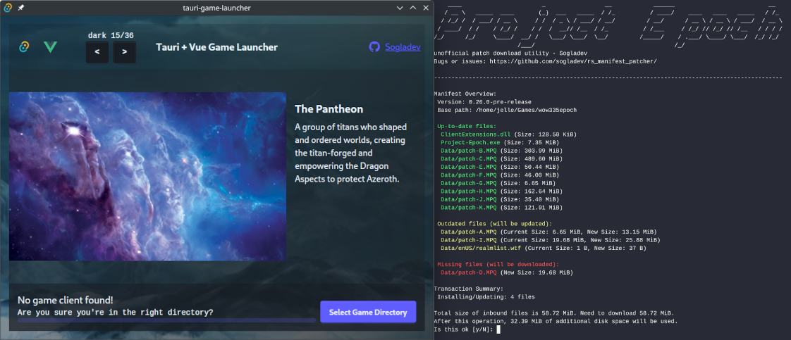
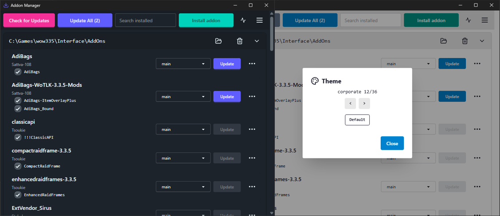
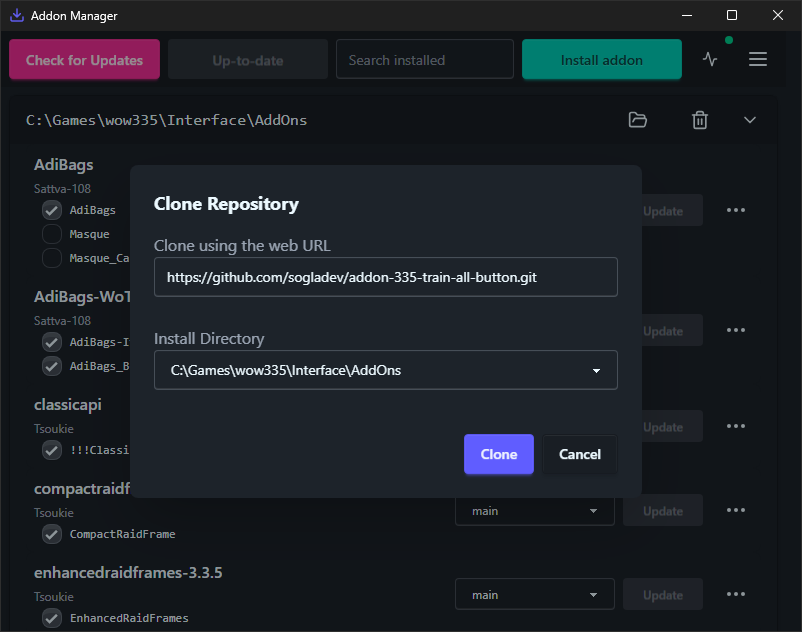
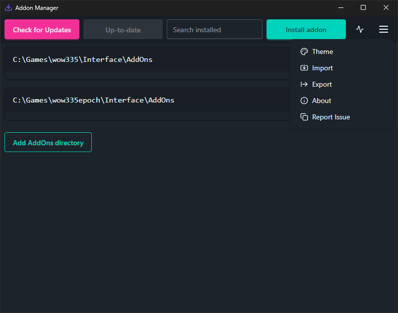

# Rs Game Suite

This monorepo contains cross-platform (Windows + Linux + MacOS) tools:

- A GUI launcher (Tauri + Vue.js) that includes patching
- A CLI patcher (Rust)
- A GUI addon manager (Tauri + Vue.js) to manage addons with git

Note that the patcher includes support for [Project Epoch](https://www.project-epoch.net/play/) via `epoch_patcher-cli`. See releases for binaries or build it yourself with `-features production`





[//]: # 'Table of Contents'

## Table of Contents

- [Addon Manager](#addon-manager)
- [Patcher](#patcher)
    - [CLI Patcher](#cli)
    - [GUI Launcher](#gui)
- [Tech Stack](#tech-stack)
- [Local Development](#local-development)

## Addon Manager

| Feature                                  | Supported         |
| ---------------------------------------- | ----------------- |
| Windows, Linux, MacOS                    | Yes               |
| Install, Remove, Update addons           | Yes               |
| git sources GitHub, GitLab, etc          | Yes               |
| Install all                              | Yes               |
| Update all                               | Yes               |
| Multiple addon directories               | Yes               |
| Import / Export addon list               | Yes               |
| Switch Git branches                      | Yes               |
| Manage subaddons                         | Yes               |
| Install via Git (HTTPS)                  | Yes               |
| Install via Git (SSH)                    | Not planned       |
| Install from GitHub Releases or Packages | Not yet supported |
| Manage non-Git addons                    | Not yet supported |



<video controls src="images/addon-manager/import-video.mp4" title="Title"></video>

```
C:\Games\wow335\Interface\AddOns AdiBags *https://github.com/Sattva-108/AdiBags.git main
```

## Patcher

| Feature                                 | CLI (Rust)     | GUI (Tauri + Vue.js)   |
| --------------------------------------- | -------------- | ---------------------- |
| Manifest-based patch updates            | Yes            | Yes                    |
| Integrity verification                  | No             | Yes                    |
| Remove deprecated patches               | Yes            | Yes                    |
| Transaction overview                    | Console output | Detailed visual output |
| Directory selection                     | No             | GUI-based              |
| Launch executable (wine on non-Windows) | No             | Yes                    |
| Customizable front-end                  | N/A            | Yes                    |
| Client download                         | Not planned    | Not yet supported      |
| Manage addons                           | Not planned    | Not planned            |

### CLI

A lightweight Rust-based terminal CLI for basic patching. It downloads patches from a `manifest.json`

- Download the CLI binary for your platform from the release
- Place the binary in your WoW folder (where `Wow.exe` is located)
- Run the CLI binary to apply patches

### GUI

A Tauri + Vue.js wrapper around the same Rust libraries:

- Allows directory selection
- Provides art, transaction overviews, and a launch button
- Uses the same patching logic as the CLI


https://github.com/user-attachments/assets/7c642947-a57c-46b0-aab9-eeb456b6e115

- Download the GUI binary for your platform from the release
- Install the GUI application before launching it. This does not need to be your game folder
- Upon first launch, select your WoW game folder
    - The selected folder will be stored in:
        - Windows: `%appdata%`
        - Linux: `$XDG_CONFIG_HOME` or `~/.local/share`
        - MacOS: `~/Library/Application Support`
- After patching is complete, the launcher can start the game executable.
  note: On non-Windows platforms, Wine will use the `.wine` directory located in the game folder by default. This behavior can be overridden by setting the `WINEPREFIX` environment variable before launching the GUI.

## Tech Stack

[](https://www.rust-lang.org)
[](https://vuejs.org)
[](https://tauri.app)
[](https://daisyui.com)

### Core Technologies

- **CLI:** Rust-based command line interface
- **GUI:** Tauri + Vue.js application with DaisyUI components

## Local Development

### Prerequisites

- Install Rust from the https://www.rust-lang.org/
- Install Bun package manager from https://bun.sh/docs/installation

### Formatting & Pre-commit

To set up formatting and the pre-commit hook:

1. Install Prettier and the Vue Prettier config:

    ```sh
    bun add -D prettier @vue/eslint-config-prettier
    ```

2. Set up the pre-commit hook by creating `.git/hooks/pre-commit` with:

    ```bash
    #!/bin/sh

    cargo fmt --all
    bun run prettier --write .
    ```

    Make sure the hook is executable:

    ```sh
    chmod +x .git/hooks/pre-commit
    ```

```bash
bun add -D prettier @vue/eslint-config-prettier
bunx eslint --ext .ts,.vue addon-manager-gui/src/
```

### Local CDN

The local CDN serves patch files and the manifest for both the CLI and GUI. Run these commands from the project root:

```sh
cd manifest-cdn
# Generate manifest.json (run once or when files change)
cargo run --bin manifest-cdn -- --create
# Start the local CDN server
cargo run --bin manifest-cdn
```

## CLI

From project root

1. Run the CLI

    ```sh
    # Demo mode (default)
    cargo run --bin downloader-cli

    # Production mode (sets production banner, description, and manifest URL)
    cargo run --features production --bin downloader-cli
    ```

1. Build

    ```sh
    # Demo build (default)
    cargo build --bin downloader-cli --release --locked
    cargo build --bin downloader-cli --target x86_64-pc-windows-gnu --release --locked

    # Production build (sets production banner, description, and manifest URL)
    cargo build --features production --bin downloader-cli --release --locked
    cargo build --features production --bin downloader-cli --target x86_64-pc-windows-gnu --release --locked
    ```

### GUI

From `launcher-gui/`

1. Install dependencies:

    ```sh
     bun install
    ```

1. Start the development server

    ```sh
    # Demo mode (default)
    bun run tauri dev

    # Production mode (sets production banner, description, and manifest URL in the GUI)
    bun run tauri dev --features production
    ```

1. Build the project

    ```sh
    # Demo build (default)
    bun run tauri build

    # Production build (sets production banner, description, and manifest URL in the GUI)
    bun run tauri build --features production
    ```

#### Fake client directory setup

The downloader CLI does not do any client validation.

```
mkdir -p client client/Data
touch client/Battle.net.dll
touch client/Data/lichking.MPQ
touch client/Data/patch-3.MPQ
```

## License
