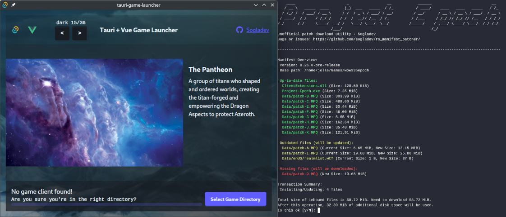
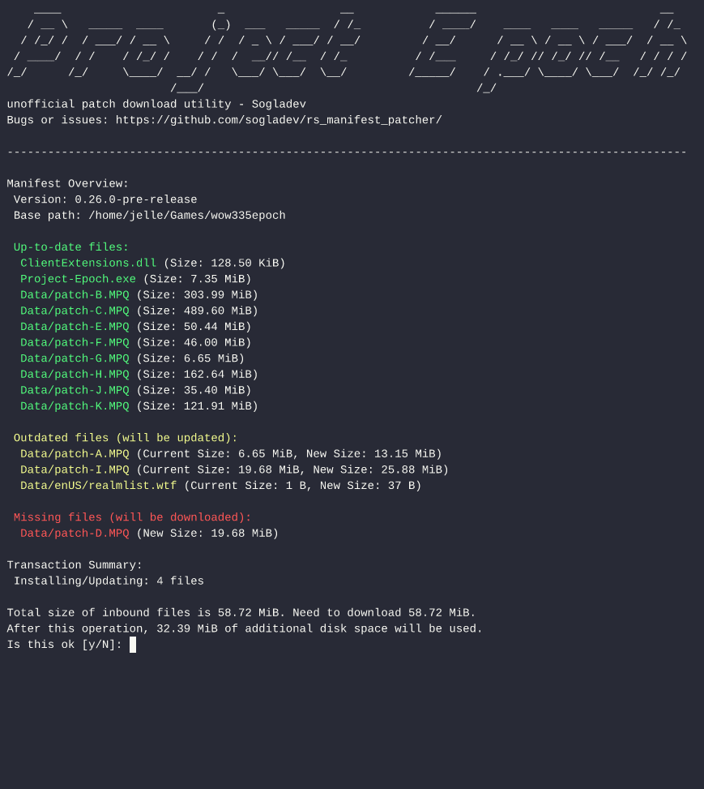
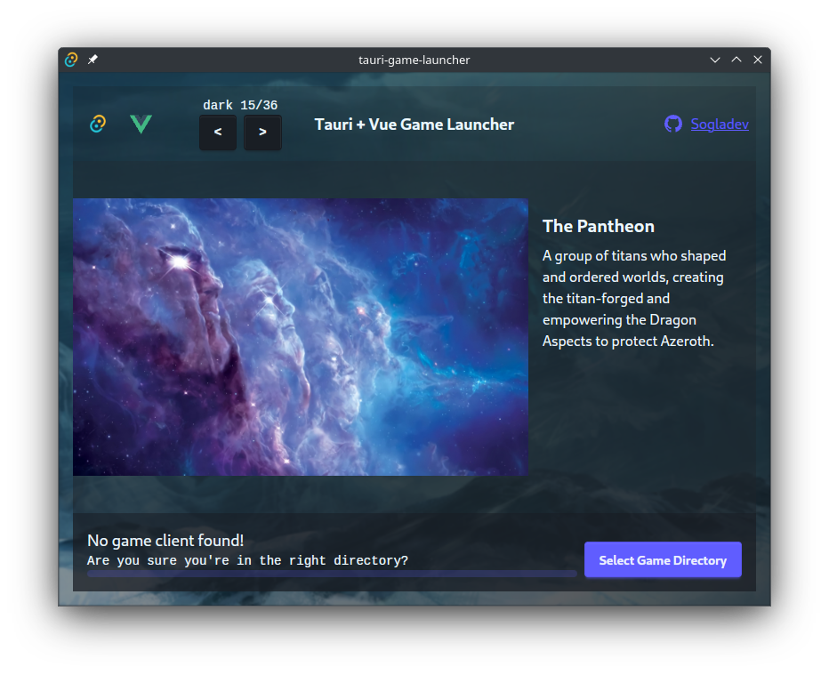

# Rs Game Launcher
This monorepo contains a cross-platform (Windows + Linux) game launcher in 2 forms: minimal CLI downloader (Rust) and a Tauri-based GUI launcher. It is designed to manage patch updates using a manifest. The launcher displays a transaction overview, detailed progress, and only overwrites files listed in the manifest without removing extra files.

The project is designed for easy extension with minimal dependencies, utilizing shared Rust libraries for backend operations while keeping the front-end lightweight.



## Tech Stack
[](https://www.rust-lang.org)
[](https://vuejs.org)
[](https://tauri.app)
[](https://daisyui.com)

### Core Technologies
- **CLI:** Rust-based command line interface
- **GUI:** Tauri + Vue.js application with DaisyUI components

## Feature Comparison

| Feature                              | CLI (Rust)     | GUI (Tauri + Vue.js)   |
| ------------------------------------ | -------------- | ---------------------- |
| Manifest-based patch updates         | Yes            | Yes                    |
| Integrity verification               | No             | Yes                    |
| Transaction overview                 | Console output | Detailed visual output |
| Directory selection                  | No             | GUI-based              |
| Launch WoW.exe (wine on non-Windows) | No             | Yes                    |
| Customizable front-end               | N/A            | Yes                    |
| Client download                      | Not planned    | Not yet supported      |
| Manage addons                        | Not planned    | Not planned            |

## CLI Details
A lightweight Rust-based terminal CLI for basic patching. It only downloads patches from a manifest.json



## GUI Details
A Tauri + Vue.js wrapper around the same Rust libraries:
- Allows directory selection
- Provides art, transaction overviews, and a launch button
- Uses the same patching logic as the CLI



https://github.com/user-attachments/assets/7c642947-a57c-46b0-aab9-eeb456b6e115

## Local Development
Install Rust from the [official Rust website](https://www.rust-lang.org/).

### Test CDN Server
Requires: go or compiled binary https://github.com/sogladev/go-manifest-patcher/releases

Use this test server to generate a manifest and serve files:
```sh
go run main.go --help
go run main.go -create-manifest
go run main.go
```

### CLI
Requires: Rust, Cargo

```sh
cargo run --bin downloader-cli -- --manifest="http://localhost:8080/manifest.json"
```

```sh
cargo build --bin downloader-cli --release --locked
cargo build --bin downloader-cli --target x86_64-pc-windows-gnu --release --locked
```

### GUI
Requires: Rust, Cargo, Bun

From `tauri-game-launcher/`:
```sh
bun run tauri dev
```
```sh
bun run tauri build
```

## License
